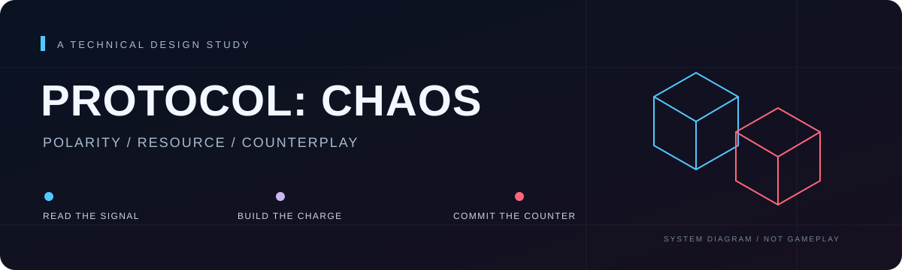
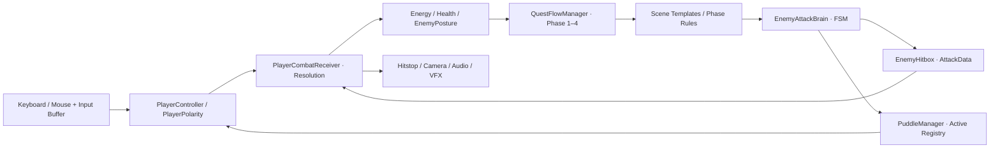

<p align="center"></p>

<p align="center"><strong>让防御积累资源，让反击消耗资源。</strong><br>A resource-driven polarity combat prototype.</p>

<p align="center">Unity 6000.3.6f1 · C# · URP 17.3 · Single-scene tutorial · 9-day initial prototype</p>

<p align="center"><a href="https://app.notion.com/p/3b56dbf617ac81e9b640cf2823cf4629">Portfolio case study</a> · <a href="docs/architecture.md">Architecture</a> · <a href="docs/design-decisions.md">Design decisions</a> · <a href="docs/validation.md">Validation & limits</a> · <a href="docs/setup.md">Setup</a></p>

## 一个动作设计问题

**如果弹刀也需要“弹药”，玩家会怎样组织防御与反击？**

PROTOCOL: CHAOS 是一个第三人称极性动作原型。玩家通过同色吸收或 Dash / Jump 近失规避积累秩序能量，再消耗能量弹反异色攻击、积累敌人架势，最终触发处决。敌人的距离权重出招与攻击落点污染区，为这条资源循环增加时间和空间压力。

这是实习期间完成的个人项目，不代表腾讯 IEG 的官方产品或团队交付。初版开发周期为 9 天；2026 年 9 月的仓库与作品集整理单独记录，不能计入初版工期。设计与架构决策由作者负责，部分代码实现、调试与文档整理使用 AI 辅助，详见[贡献说明](docs/credits.md)。

> **当前交付：技术作品集源码快照。** 原先被忽略的 Prefab、Shader、音频和字体已纳入版本管理并保留 GUID。工程入口见[Setup](docs/setup.md)。本次文档与资源整理未重新执行 Unity 编译、测试或 Windows 构建，也未发布新的可玩包。

## 技术亮点

| 设计需求 | 实现方式 | 可追溯入口 |
| --- | --- | --- |
| 同一次攻击根据玩家状态产生不同结果 | `AttackData` + `IDamageable` 传递攻击；受击端按规避 → 异色弹刀 → 同色吸收 → 普通伤害处理 | [CombatProtocol](Assets/Scripts/Systems/Combat/CombatProtocol.cs)、[PlayerCombatReceiver](Assets/Scripts/Player/PlayerCombatReceiver.cs) |
| 高收益反击需要前置资源投入 | 3 格容量、规避 +2、吸收 +1、弹刀消耗 3；事件通知能量与阶段进度 | [PlayerEnergySystem](Assets/Scripts/Player/PlayerEnergySystem.cs) |
| 命中与擦身规避都可以观察 | 状态机激活 `OverlapBoxNonAlloc`；命中盒与 1.5 倍近失盒；以受击接口去重；Gizmos 显示判定范围 | [EnemyHitbox](Assets/Scripts/Enemy/EnemyHitbox.cs) |
| 先学 Timing，再承担资源压力 | Phase 2 在敌人前摇时补满能量，保留真实消耗；Phase 3 清空旧能量并恢复充能规则 | [QuestFlowManager](Assets/Scripts/Systems/Core/QuestFlowManager.cs) |
| 敌人给出可调节的时间与空间压力 | 距离改变红蓝出招权重；额外慢刀变体；地面射线确定污染区落点 | [EnemyAttackBrain](Assets/Scripts/Enemy/EnemyAttackBrain.cs) |
| 环境状态有集中查询入口 | 管理器维护活跃污染区，玩家每 0.1 秒轮询；重叠区取最高伤害和最低速度倍率 | [PuddleManager](Assets/Scripts/Environment/PuddleManager.cs)、[PlayerController](Assets/Scripts/Player/PlayerController.cs) |
| 打击反馈与命中结果对齐 | Hitstop、Cinemachine Impulse、音效与 Tween；需跨顿帧播放的表现使用独立更新时间 | [CombatFeedbackManager](Assets/Scripts/Systems/Combat/CombatFeedbackManager.cs)、[TimeManager](Assets/Scripts/Systems/Core/TimeManager.cs) |

这些是可在源码定位的实现手段，不代表已证明整体零 GC、玩家理解或性能提升比例。当前弹刀反馈/架势存在重复结算路径，污染区也缺少常规回收预算，见[已知限制](docs/validation.md)。

## 运行架构



场景是装配入口，C# 事件传递进度，Inspector 保存调参数据。当前采用场景单例、序列化引用与查找兜底的混合架构；这是单场景原型的实际结构。进一步的调用链、配置覆盖、时间域与生命周期边界见[架构说明](docs/architecture.md)。

## 四阶段教学

| 阶段 | 学习重点 | 当前目标 |
| --- | --- | --- |
| 01 · 协议初始化 | 同色吸收 | 吸收 3 次 |
| 02 · 熵减测试 | 异色弹刀 Timing；前摇自动注能 | 弹刀 2 次 |
| 03 · 能量循环 | 恢复完整充能来源，连接架势与处决 | 满能 1 次且处决 1 次 |
| 04 · 绝对失序 | Boss 与环境压力下的综合运用 | Boss 处决 2 次后进入终幕 |

Phase 3 并不强制玩家采用特定的充能组合；“资源规则是否足以鼓励主动位移”仍是需要策略对照试玩的问题。

| 输入 | 动作 | 输入 | 动作 |
| --- | --- | --- | --- |
| WASD | 移动 | 鼠标右键 | 切换红 / 蓝极性 |
| Space | 跳跃 | 鼠标左键 | 弹刀窗口 |
| Left Shift | Dash | F | 处决 |
| R | 死亡后重开 | F8 | 性能面板 |

## 一项有记录的设计取舍

异常核心弹刀曾触发全场净化。它提供了强烈的成功反馈，却可能一次性移除后续走位压力。原型因此撤下 Gameplay Trigger，保留净化事件与表现管线。

删除调用可追溯至 [f0a647b](https://github.com/Furinasd/PROTOCOL-CHAOS/commit/f0a647b)。撤下的设计理由来自作者复盘；仓库目前没有量化试玩数据，不能据此声称体验改善了某个比例。后续仍需独立解决污染区数量与回收预算，详见[决策记录](docs/design-decisions.md)。

## 阅读源码

```text
Assets/Scripts/
├── Player/             移动、输入缓冲、极性、能量、受击
├── Enemy/              攻击状态机、判定盒、架势、Tutorial Boss
├── Environment/        污染区、对象池、场地边界
├── Systems/Combat/     攻击协议与战斗反馈
├── Systems/Core/       教学流程、转场、重开、时间
├── Systems/Camera/     镜头与 FOV
├── Systems/Debug/      判定配置诊断与性能面板
├── UI/                 能量与任务反馈
└── SFX&BGM/            三通道音频管理
```

建议阅读顺序：`CombatProtocol` → `EnemyAttackBrain / EnemyHitbox` → `PlayerCombatReceiver` → `EnemyPosture` → `QuestFlowManager`。

## 工程与后续方向

- [恢复工程与依赖](docs/setup.md)：Unity 版本、资源清单、场景入口与存档注意事项。
- [验证记录与已知限制](docs/validation.md)：区分源码检查、配置检查、运行观察和玩家验证。
- [架构与生命周期](docs/architecture.md)：了解参数事实源与模块边界。
- [设计决策与下一步](docs/design-decisions.md)：资源经济、教学隔离、净化取舍及验证计划。
- [资源与贡献说明](docs/credits.md)：个人项目边界、第三方资源与 AI 协作。

优先级：资源交付完整性 → Phase 2 与污染区稳定性 → Windows 完整流程 → 首次玩家和策略验证。继续保留当前四阶段范围。

原创代码与自制资产按 [MIT License](LICENSE) 开放；第三方插件、字体、音频等保留各自授权，不适用本项目 MIT 再授权。参见[资源与授权边界](docs/credits.md)。
