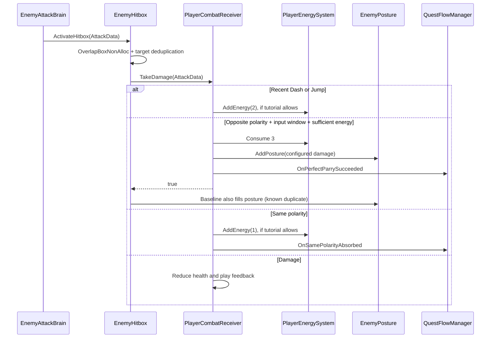

# Architecture · PROTOCOL: CHAOS

> Source baseline: `9e8645740638823913a3dd18915287f61138c479`. Documentation and authored asset packaging: 2026-09-12. Runtime fixes in the local worktree are not part of this delivery.

## 1. 场景装配与配置

唯一启用的 Build Scene 是 [MainScene](../Assets/Scenes/MainScene.unity)。玩家、流程管理器、四个阶段模板、镜头、HUD、音频与污染区管理器在场景内装配。模板位于禁用的 `Template` 父对象下，流程按阶段实例化并清理敌人。

配置优先级：场景实例覆盖 → Prefab 序列化值 → C# 默认值。不要只改字段默认值就判断调参生效。当前没有独立的 ScriptableObject 玩法配置层，也没有自定义运行时 asmdef。

| 对象 | 状态所有者 | 主要协作方式 |
| --- | --- | --- |
| 位移、Dash、Jump、输入缓冲 | PlayerController | 输入轮询、缓存组件引用 |
| 玩家颜色 | PlayerPolarity | 红蓝状态与表现 |
| 攻击生成 | EnemyAttackBrain | FSM / 协程 / Inspector |
| 攻击命中去重 | EnemyHitbox | 每次激活清空 HashSet |
| 受击分支 | PlayerCombatReceiver | AttackData、能量与反馈调用 |
| 敌人架势和 HP | EnemyPosture | C# 事件、处决重置 |
| Boss 处决次数与终幕 | TutorialBoss | 状态与事件订阅 |
| 教学进度 | QuestFlowManager | 战斗事件、PlayerPrefs、模板实例 |
| 污染区注册与池 | PuddleManager | 活跃列表、取池 / 回池 |

## 2. 从攻击到处决

`AttackData` 含伤害、极性、来源坐标、方向与来源对象；`IDamageable` 的 bool 返回值表示是否发生完美弹刀，并不是完整的命中结果枚举。受击端负责资源与反制，但已提交基线的 Hitbox 仍追加反馈和打满架势，形成双重所有权。后续应统一结算方，并同步修订接口注释；本次只记录这个边界，不声明修复。

架势达到阈值进入可处决状态。普通敌人由 `EnemyPosture.Execute()` 按配置扣 HP 并在存活时重置架势；Boss 优先由 `TutorialBoss.TryExecuteFromPlayer()` 计数，在达到两次处决时强制终幕。

## 3. 输入、时钟与判定

玩法直接消费 `Keyboard.current / Mouse.current`；Input Actions 当前主要服务 UI。玩家缓冲保存 Dash / 极性切换 / 弹刀 / 处决请求，弹刀端还存在鼠标输入兜底。

| 计时用途 | 当前时间源 | 验证重点 |
| --- | --- | --- |
| Dash / Jump 0.3 秒规避窗 | Time.time | 顿帧是否有意延长真实时间内的窗口 |
| 输入缓冲 | Time.time | 过期与消费的帧顺序 |
| 弹刀窗口 | Time.unscaledTime | 连续点击、顿帧和缓冲兜底 |
| Hitstop 恢复 | WaitForSecondsRealtime | 重叠请求与重开恢复 |
| 部分 VFX / UI Tween | SetUpdate(true) | 暂停和对象禁用后的生命周期 |

移动加窗使用每帧水平位移阈值，需要在不同帧率下验证。自制 Player Prefab 的弹刀窗口为 0.20 秒，移动额外 0.10 秒；代码默认值 0.22 秒不是此 Prefab 的实际基准。

判定盒使用带缩放的半尺寸进行物理查询；近失范围为其 1.5 倍。NonAlloc 固定缓冲满时输出警告。Gizmos 属于 Editor 调试；`InspectHitbox` 仅输出启动配置。当前不是独立物理系统，依然依赖 Unity Physics 查询。

## 4. 教学与持久化

P1：吸收奖励开启、规避奖励关闭。P2：两类充能奖励关闭，敌人前摇事件触发注能，弹刀照常消耗。P3：清空旧能量，恢复完整规则，检查满能与处决。P4：Boss 实体销毁后完成。

`QuestFlow_Valid / Phase / Absorb / Parry / Energy / Execute` 保存阶段进度。死亡重载场景不等于清除教学存档；回归从头教学需要先清除进度。Phase 3 未刷出目标时会跳过处决门槛，开发兜底不得作为交付验证通过的依据。

## 5. 环境生命周期

敌人攻击 → Ground Layer 6 射线落点 → GetPuddleFromPool → Contaminate → ActivePuddles → 玩家低频轮询。重叠取最大伤害 / 最低速度倍率，水平距离检测不检查玩家高度或颜色。环境伤害绕过极性 / 弹刀结算，能量每停留 3 秒流失一格。

预热数量为 10；耗尽会创建新对象。回池只在 `ChaosPuddle.Purify()` 的动画结束后执行。当前 Gameplay 不触发全场净化，也没有找到常规超时回收或数量上限。因此“有池”是代码事实，“持续复用且有界”仍是待完成的契约。

## 6. 性能与扩展边界

已采用的局部手段：NonAlloc 查询、活跃列表、部分 MPB、事件驱动 HUD、预热池。仍存在命中日志、组件查找、材质实例访问及动态扩容可能，不能概括为全局零 GC。

`PCPerformanceMonitor` 展示 FPS、帧时间和内存等信息；托管内存占用不是每帧分配。性能结论需要目标硬件、Player 构建、固定压力场景和 Profiler 捕获。

第二场景、暂停、多敌人扩展之前，先解决单例生命周期、时间请求覆盖与结算所有权。当前无需为作品集引入通用战斗框架或拆分大量程序集。
